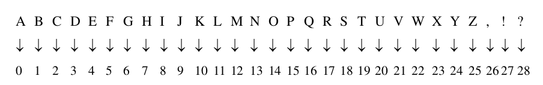
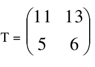
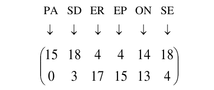
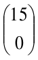
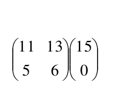
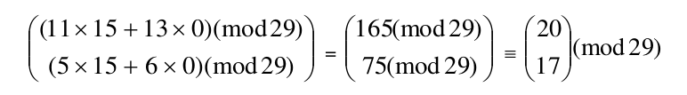
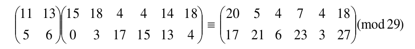
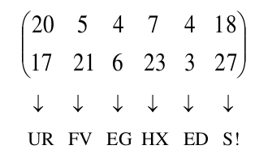

# Hill-cipher
It is an cryptography algorithm use symetric encryption/decryption and it has encrypt key as matrix \[n\*n\], n={1,2,...,n}
for more informations see on wikipedia [here](https://en.wikipedia.org/wiki/Hill_cipher)
## how it work 
1. We start by grouping the letters of the plain text into blocks of **m** characters.
2. Each block it should numberized.
3. We code each block using a certain matrix.
4. We transform the results into letters.
5. Calculations are made according to the number of letters of the alphabet. 

We are working with an alphabet of 29 characters because 29 is a prime number.
## Algorithm of Hill
#### Example:
let's say we have the message **"NO RESPONSE"** using a block length **m = 2** and a matrix of key T:  
1. The letters **2** to **2** are grouped together: **PA SD ER EP ON SE**
2. By digit each block, we obtain:

  
 
3. We code each pair by multiplying it by **T**: 
Thus, for the first couple, we calculate:  =

We can code all the couples at the same time by multiplying T by the matrix of couples:

4. We transform the resulting matrix into letters: 

The result is therefore: **PASDEREPONSE ==> URFVEGHXEDS!** 
## running steps
- first install matlab on your machine.
- on the terminal type:
''' git clone https://github.com/borhanDZ/Hill-crypto.git       '''
- or just download the file as zip on windows machines
- copy the hill app on matlab project path.
- open matlab and then open the folder path, on workspace type 
      '''>>HILL                                             '''
